<div align="center">

# LiteOps

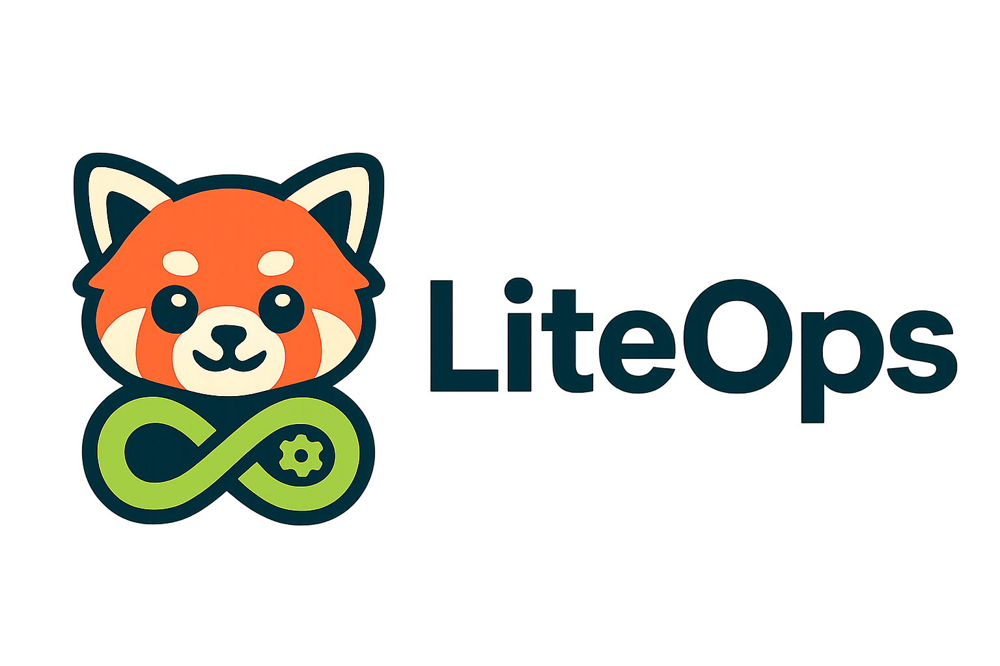

**A lightweight, practical CI/CD platform for teams that need simple build and deployment automation.**

</div>

<p align="center">
  
  
  
  
  
</p>

> The GitHub source code is the canonical latest version. The public website and Docker Hub images may lag behind the repository.

## Overview

LiteOps is a focused CI/CD platform for automating build and deployment workflows without the operational complexity of a large CI system. It is designed around practical day-to-day needs: project management, environment configuration, reusable credentials, parameterized build tasks, build history, real-time logs, notifications, and GitLab webhook triggers.

The goal is to provide a workflow that feels as approachable as a Jenkins freestyle job while still giving teams clear visibility into build status, execution logs, and deployment outcomes.

## Features

- Project and service management
- Environment management for development, testing, staging, and production workflows
- Build task configuration with branches, parameters, stages, external script repositories, and notifications
- Manual and GitLab webhook-triggered builds
- Real-time build log streaming and stage-level log views
- Build history, dashboard statistics, build trends, and recent build summaries
- Credential management for GitLab tokens, SSH keys, and kubeconfig files
- Notification robot configuration and test delivery
- User, role, permission, LDAP, login log, and basic system security management
- Docker-based deployment option with Docker-in-Docker support for CI tasks

## Screenshots

<table align="center" width="100%">
  <tr>
    <td align="center" width="50%">
      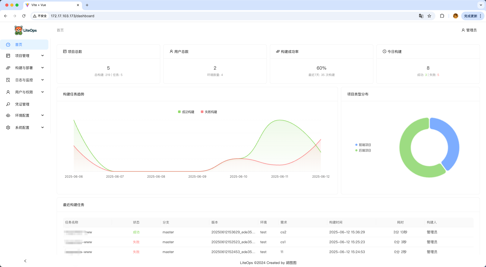
    </td>
    <td align="center" width="50%">
      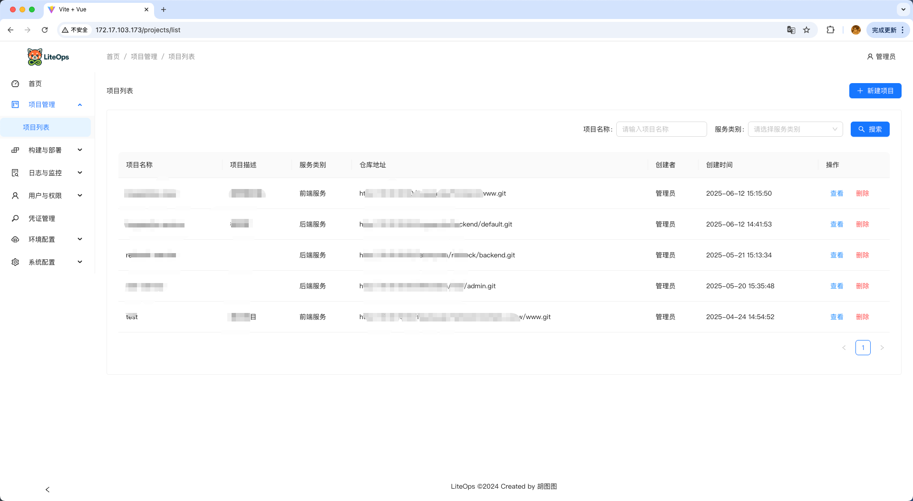
    </td>
  </tr>
  <tr>
    <td align="center">
      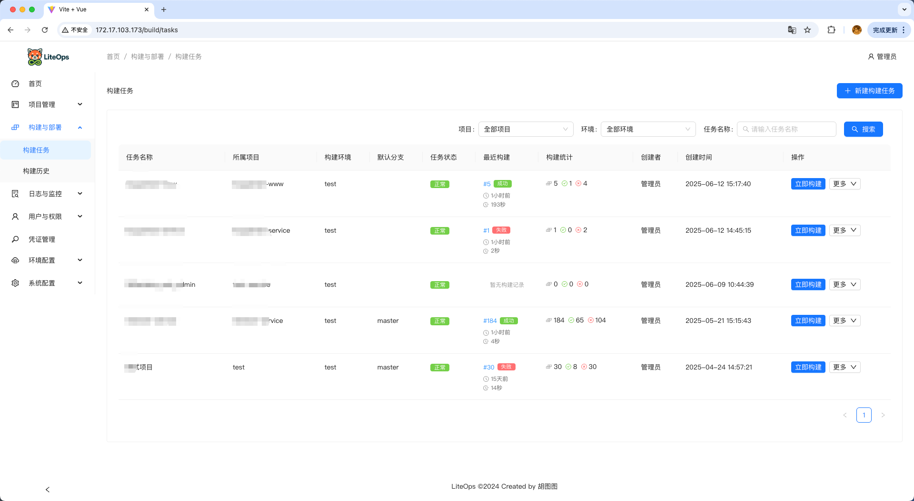
    </td>
    <td align="center">
      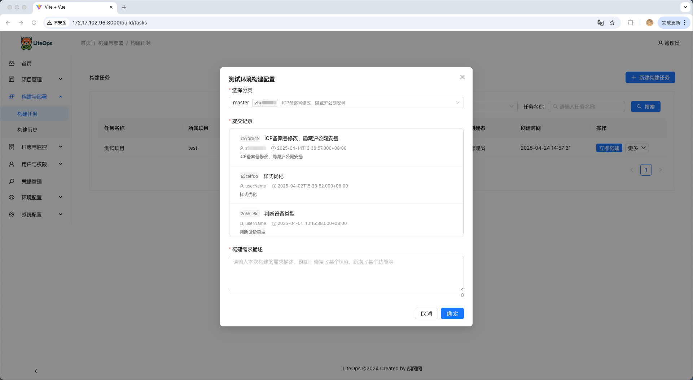
    </td>
  </tr>
  <tr>
    <td align="center">
      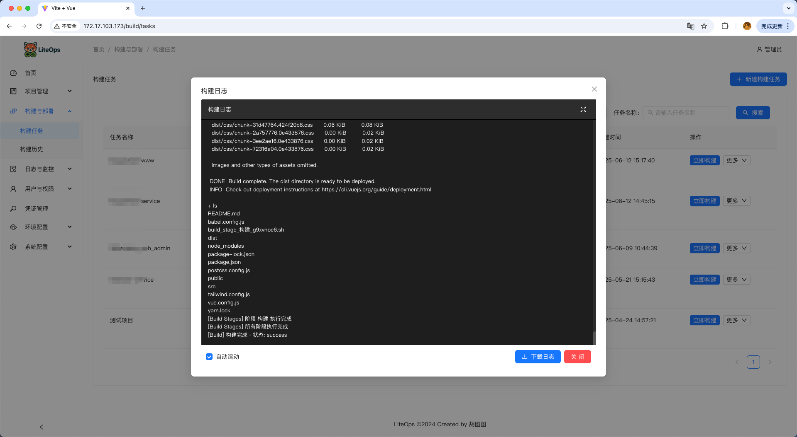
    </td>
    <td align="center">
      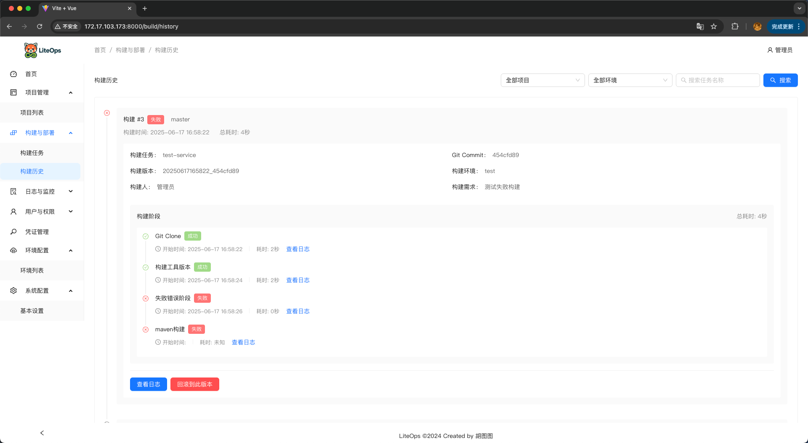
    </td>
  </tr>
  <tr>
    <td align="center">
      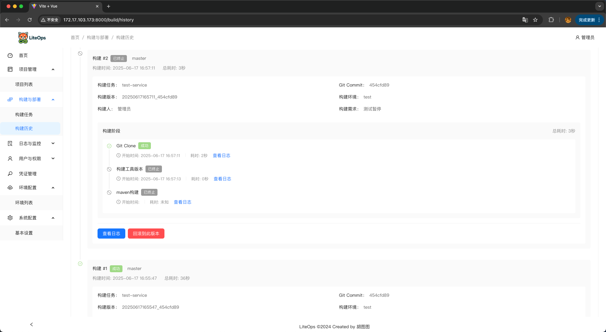
    </td>
    <td align="center">
      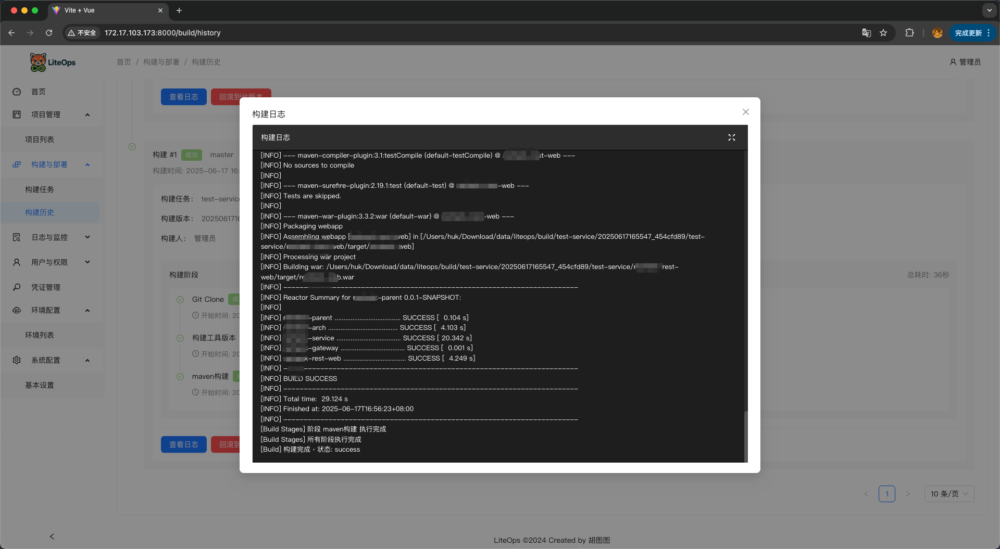
    </td>
  </tr>
  <tr>
    <td align="center">
      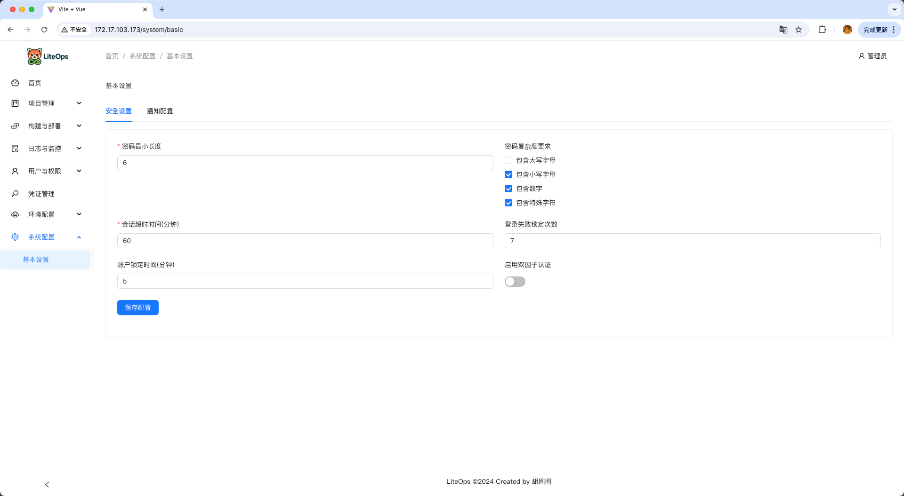
    </td>
    <td align="center">
      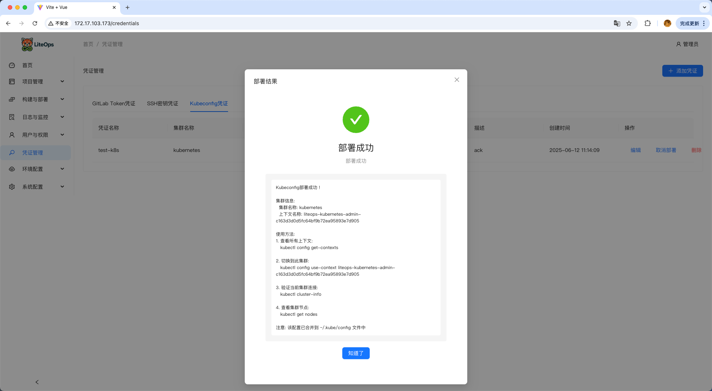
    </td>
  </tr>
  <tr>
    <td align="center">
      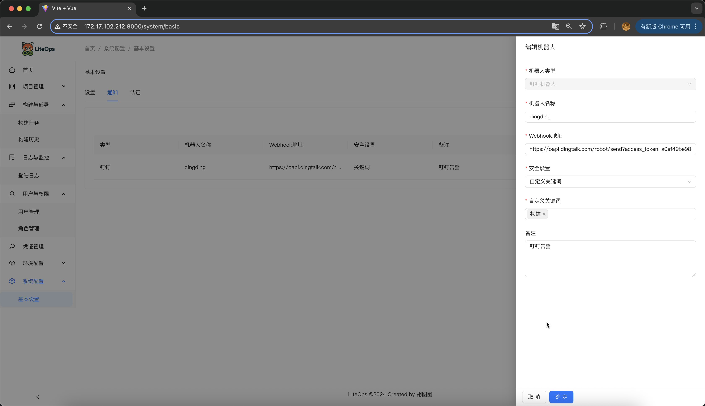
    </td>
    <td align="center">
      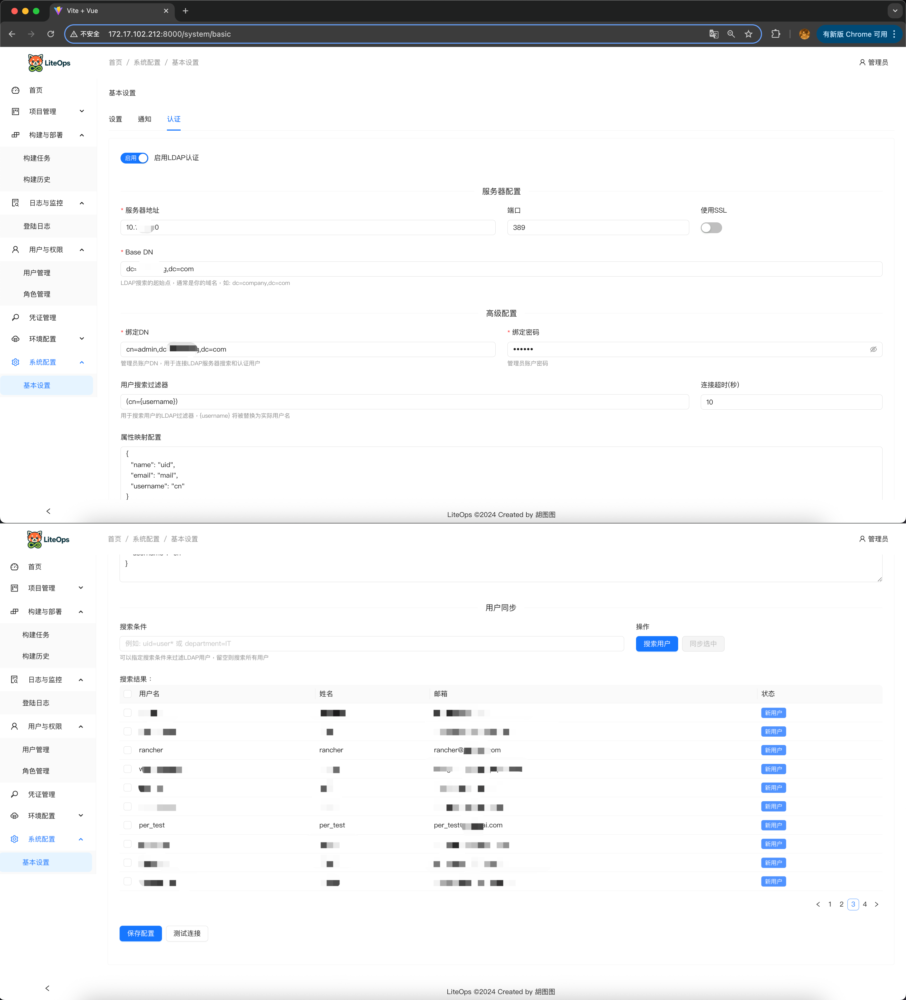
    </td>
  </tr>
</table>

## Tech Stack

### Frontend

- Vue 3
- Ant Design Vue 4.x
- Vue Router
- Axios
- ECharts
- Vite

### Backend

- Python 3.9+
- Django 4.2
- Uvicorn / ASGI
- MySQL 8
- PyMySQL
- GitPython
- python-gitlab
- PyJWT
- LDAP support through ldap3

## Repository Layout

```text
.
|-- backend/                 # Django backend and API implementation
|-- web/                     # Vue 3 frontend application
|-- image/                   # README screenshots and support images
|-- liteops-www/             # Documentation website source
|-- liteops_init.sql         # Initial MySQL schema and data
|-- start.sh                 # Source development startup script
|-- start-containers.sh      # Docker deployment helper script
|-- Dockerfile               # Docker-in-Docker application image
`-- nginx.conf               # Nginx config for the container image
```

## Source Deployment

Use this path when you want to run LiteOps from the repository.

### Requirements

- Python 3.9+
- Node.js 18+
- MySQL 8.0+
- Git
- Docker, kubectl, Maven, or other build tools as required by your own build stages

### 1. Clone the repository

```bash
git clone https://github.com/opsre/LiteOps.git
cd LiteOps
```

### 2. Initialize MySQL

Create the database and import the initial data:

```bash
mysql -uroot -p < liteops_init.sql
```

Then update `backend/conf/config.txt` to match your MySQL connection:

```ini
[client]
host = 127.0.0.1
port = 3306
database = liteops
user = root
password = your_password
default-character-set = utf8mb4
```

### 3. Start the backend

```bash
cd backend
pip3 install Django==4.2.13
pip3 install -r requirements.txt
python3 -m uvicorn backend.asgi:application --host 0.0.0.0 --port 8900
```

The backend API is available at:

```text
http://localhost:8900
```

### 4. Start the frontend

Open a new terminal:

```bash
cd web
npm install
npm run dev
```

The Vite development server is configured to run at:

```text
http://localhost:8000
```

### 5. Optional one-command startup

From the project root:

```bash
chmod +x start.sh
./start.sh
```

The script checks ports `8900` and `8000`, installs missing dependencies, starts the backend and frontend, and cleans up child processes when you press `Ctrl+C`.

## Docker Deployment

Use Docker when you want a quick evaluation environment.

### 1. Prepare deployment files

You need these files in your deployment directory:

- `start-containers.sh`
- `liteops_init.sql`
- The LiteOps Docker image

### 2. Pull the image

```bash
docker pull liteops/liteops:<version>
```

### 3. Run the helper script

```bash
chmod +x start-containers.sh
./start-containers.sh
```

The script creates a Docker network, starts MySQL, imports `liteops_init.sql`, and starts the LiteOps container in privileged Docker-in-Docker mode.

After deployment:

```text
Frontend: http://localhost
Backend API: http://localhost:8900/api/
MySQL: localhost:3306
```

### Custom database configuration

You can also run LiteOps against your own MySQL instance by mounting a custom config file:

```bash
mkdir -p ./liteops-config
cat > ./liteops-config/config.txt << EOF
[client]
host = your_mysql_host
port = 3306
database = liteops
user = root
password = your_password
default-character-set = utf8mb4
EOF

docker run -d \
  --name liteops \
  --privileged \
  -p 80:80 \
  -p 8900:8900 \
  -v "$(pwd)/liteops-config/config.txt:/app/conf/config.txt" \
  liteops/liteops:<version>
```

### Verify the deployment

```bash
docker ps
docker logs liteops
```

## Default Login

```text
Username: admin
Password: admin123
```

Change the initial password after first login.

## Documentation

Feature documentation is available at:

```text
https://liteops.ext4.cn
```

## Project Status

LiteOps is still under active development. The core workflow is implemented, but many features and refinements are still evolving. Feedback from real CI/CD scenarios is welcome, especially around missing workflow features, usability improvements, and deployment pain points that are not yet covered.

## Support the Author

If LiteOps is useful to you, donations are welcome and help support continued maintenance.

<div align="center">
  <table>
    <tr>
      <td align="center">
        
        <br/>
        <strong>Alipay</strong>
      </td>
      <td align="center">
        
        <br/>
        <strong>WeChat Pay</strong>
      </td>
    </tr>
  </table>
</div>

## Supporters

<table align="center">
  <tr>
    <td align="center" width="100">
      <a href="https://github.com/willis-yang">
        
        <br/>
        <strong>willis-yang</strong>
      </a>
    </td>
    <td align="center" width="100">
      <a href="https://github.com/Lihy6472">
        
        <br/>
        <strong>Lihy6472</strong>
      </a>
    </td>
  </tr>
</table>

## Contact

- Email: hukdoesn@163.com
- Issues: https://github.com/hukdoesn/liteops/issues


## License

This project is licensed under the terms in [LICENSE](LICENSE).

---

[](https://www.star-history.com/#opsre/LiteOps&Date)
